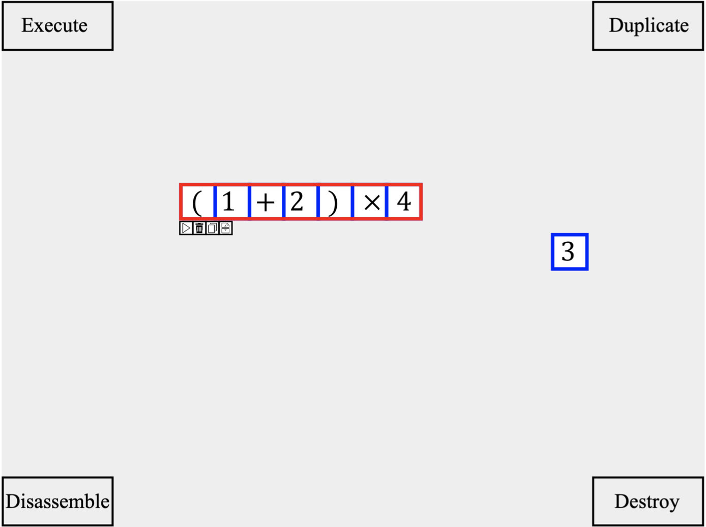

## Direct Manipulation Calculator (직접 조작 계산기)

&nbsp;&nbsp;&nbsp;&nbsp;&nbsp;&nbsp;&nbsp;&nbsp;&nbsp;&nbsp;&nbsp;&nbsp;&nbsp;&nbsp;&nbsp;&nbsp;&nbsp;&nbsp;&nbsp;&nbsp;&nbsp;&nbsp;&nbsp;&nbsp;&nbsp;&nbsp;&nbsp;&nbsp;&nbsp;&nbsp;&nbsp;&nbsp;&nbsp;&nbsp;&nbsp;&nbsp;&nbsp;&nbsp;&nbsp;&nbsp;&nbsp;&nbsp;&nbsp;&nbsp;&nbsp;&nbsp;&nbsp;&nbsp;&nbsp;&nbsp;&nbsp;&nbsp;&nbsp;&nbsp;&nbsp;&nbsp;&nbsp;&nbsp;&nbsp;&nbsp;*2019-1 휴먼컴퓨터인터페이스 프로젝트*

**웹 기반 직접 조작 계산기 (블록 조립 계산기)**

**숫자, 영문자, 연산자 등의 기호 블록을 생성하고 결합해서 수식을 만들고 계산하는 방식의 계산기**

**더 자세한 내용은 report.pdf 파일을 확인해주세요**

 

- **구현한 기능 소개**
  - 정수, 실수, 복소수의 표현과 그 기본 연산(산술연산, 비교연산)
  - 벡터, 행렬의 표현과 그 기본 연산(내적, 외적, 행렬의 곱셈, 역행렬, 행렬식)
  - 자주 사용되는 상수(PI, e) 및 함수 지원(sin, cos, tan, exp, log, sqrt)
  - 변수, 함수 정의 및 사용
  - 블록의 생성 - 키보드 숫자, 문자 키
  - 블록의 이동 - 마우스 드래그
  - 블록의 조립 - 마우스 드래그 앤 드롭
  - 블록의 실행 - 팝업 메뉴 (Canvas)
  - 블록의 분해 - 팝업 메뉴 (Canvas)
  - 블록의 복제 - 팝업 메뉴 (Canvas)
  - 블록의 소멸 - 팝업 메뉴 (Canvas)

 

- **사용한 언어 및 도구, 라이브러리**
  + HTML, CSS, Javascript
  + math.js
  + Fabric.js
  + Canvas

 

+ **개발 환경**
  + macOS Mojave
  + Visual Studio Code
  + Chrome

 

- **실행 URL**

  + https://hongchan2.github.io/calc/2/

    

- **시연 영상**

  + https://youtu.be/nYcy6bmGSo8
  
    
  
- **스크린샷**

  </img>

  

---

> 2019.11.5 최종 업데이트
>
> 광운대학교 소프트웨어학부 윤홍찬

